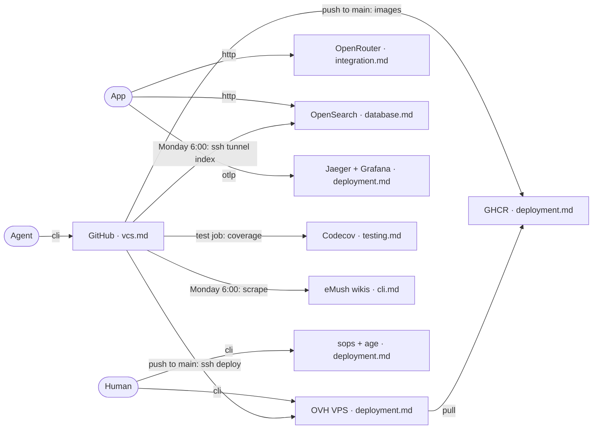

# Ecosystem

```mermaid
flowchart LR
  Human([Human])
  Agent([Agent])
  App([App])
  GitHub["GitHub · vcs.md"]
  GHCR["GHCR · deployment.md"]
  VPS["OVH VPS · deployment.md"]
  OpenRouter["OpenRouter · integration.md"]
  OpenSearch["OpenSearch · database.md"]
  Jaeger["Jaeger + Grafana · deployment.md"]
  Codecov["Codecov · testing.md"]
  Wikis["eMush wikis · cli.md"]
  Sops["sops + age · deployment.md"]

  Agent -- cli --> GitHub
  Human -- cli --> VPS
  Human -- cli --> Sops
  App -- http --> OpenRouter
  App -- http --> OpenSearch
  App -- otlp --> Jaeger

  GitHub -- "push to main: images" --> GHCR
  GitHub -- "push to main: ssh deploy" --> VPS
  GitHub -- "test job: coverage" --> Codecov
  GitHub -- "Monday 6:00: scrape" --> Wikis
  GitHub -- "Monday 6:00: ssh tunnel index" --> OpenSearch
  VPS -- "pull" --> GHCR
```
